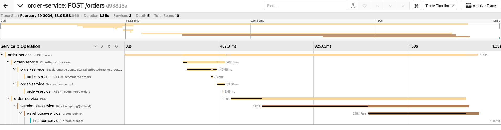
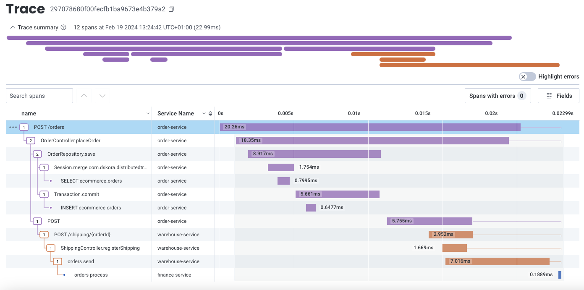

# Distributed tracing

## Getting started
Distributed tracing allows you to see how a request progresses through different services and systems, the timing of each operation, any logs and errors as they occur. <br />
OpenTelemetry Tracing is particularly valuable in the context of microservices architecture, where applications are composed of multiple independent services working together to fulfill user requests.

Java agents are a special type of class which, by using the Java Instrumentation API, can intercept applications running on the JVM, modifying their bytecode.

## Prerequisite
- Framework: Spring Boot 3.2.2 / 
- Language: Java 17
- Build Tool: Maven
- Java Agent: OpenTelemetry, Honeycomb

### Spring Boot Backend

```shell script
./mvnw clean install
```

### Run docker containers via docker compose

```shell script
docker-compose up -d
```

## Jaeger
Jaeger is an open-source distributed tracing system created by Uber.



```
export JAVA_OPTS="-Dotel.logs.exporter=none -Dotel.exporter.otlp.endpoint=http://jaeger:4317 -Dotel.exporter.otlp.protocol=grpc -javaagent:/opentelemetry-javaagent.jar"
```

## Honeycomb
Honeycomb is the observability solution designed for modern developer teams to understand the systems they build and operate.



```
export JAVA_OPTS="-Dhoneycomb.api.key=API_KEY -javaagent:/honeycomb-opentelemetry-javaagent.jar"
```

## Testing

```shell script
curl -X POST localhost:8080/orders -d '{"productId": "6ee4af91-0bd5-419d-85b9-f043ebdf70e9", "quantity": 2}' -H "Content-type: application/json"
```